### react-a11y-improvements-example

A small React project demonstrating practical accessibility (A11y) improvements.
This example shows how to refactor a simple UI to make it more usable, more semantic, and more inclusive — while keeping the code clean, modular, and easy to maintain.

This project is part of a series of micro‑examples designed to showcase your ability to improve existing codebases with accessibility‑focused enhancements.

---

## ⭐ Overview

The goal of this project is to take a basic React component and improve:

    - Accessibility

    - Semantics

    - Screen-reader support

    - Code Clarity

    - Style organisation

It demonstrates how small, intentional changes can significantly improve the user experience for everyone.

---

## 📝 Before vs After Summary

# Before

    Buttons had no ARIA labels

    No keyboard interaction states

    No semantic grouping

    Inline styles cluttered the component

    Hover/focus behaviour was inconsistent

    Code was harder to read and maintain

# After

    ARIA labels added for screen‑reader clarity

    Keyboard‑friendly interactions using useState

    Semantic HTML structure

    Styles moved into a dedicated Styles.js file

    Clean, readable component structure

    Clear visual states for interaction

---    

## ⭐ Key Accessibility Improvements

# 1. ARIA Labels

Buttons now include descriptive aria-label attributes where needed, improving screen reader clarity.

# 2. Semantic HTML

Navigation, content, and interactive elements use appropriate semantic tags.

# 3. Keyboard Interactions

Buttons respond to keyboard focus and hover states using React useState.

# 4. Visible Focus Styles

Custom focus outlines ensure keyboard users can see where they are on the page.

# 5. Modular Styles

All inline styles were moved into a dedicated Styles.js file for clarity and reusability.

# 6. Clean Component Structure

Components were refactored for readability, maintainability, and accessibility.

---

## 📁 Project Structure

react-a11y-improvements-example/
│
├── src/
│   ├── A11y.jsx
│   ├── Styles.js
│   ├── constants.js
│   ├── assets/
│   │   └── react.svg
│   └── main.jsx
│
├── package.json
├── vite.config.js
└── README.md

---

## 📸 Screenshots

/screenshots
  ├── before.png
  ├── after.png

Example Markdown:

# Before UI
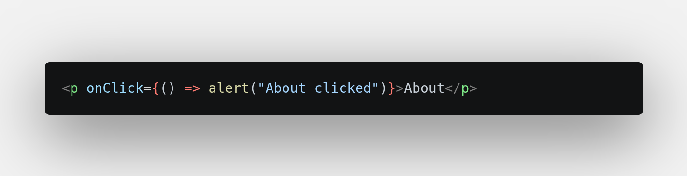

# After UI
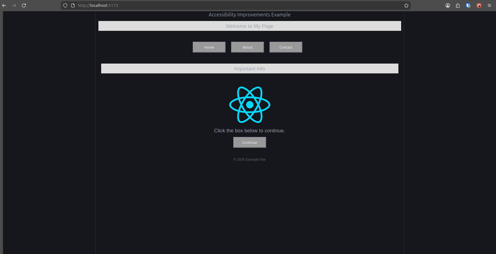

# Before Semantics are added
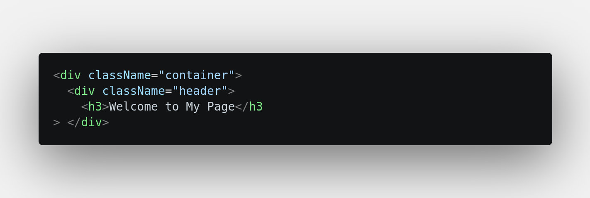

# After Semantics are added
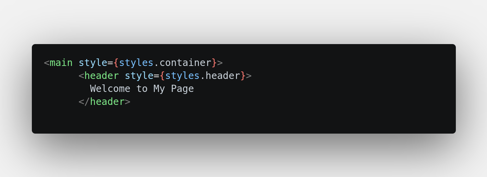

# Before Buttons
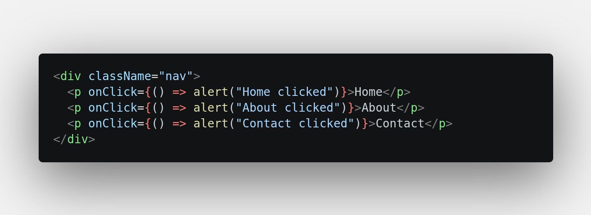

# After Buttons
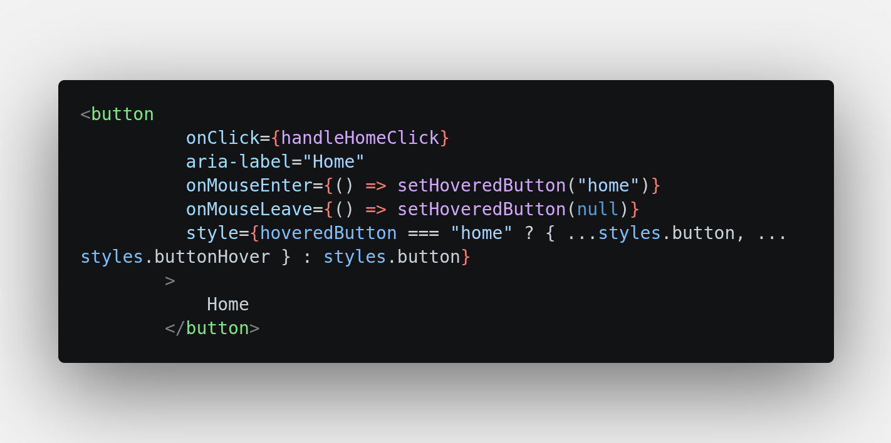

# Before ARIA
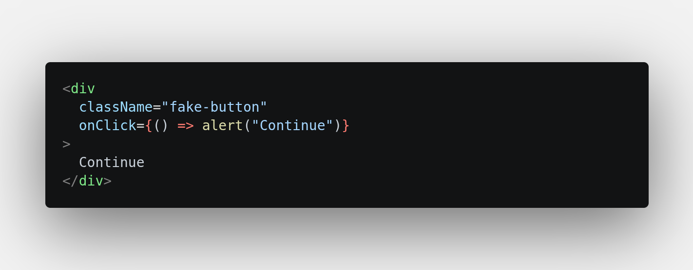

# After ARIA
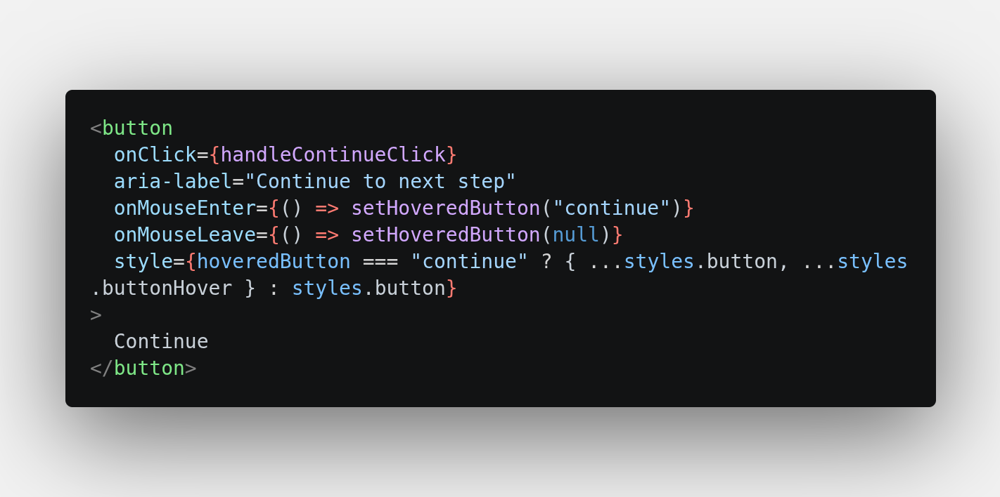

# Before Keyboard Focus

# After Keyboard Focus
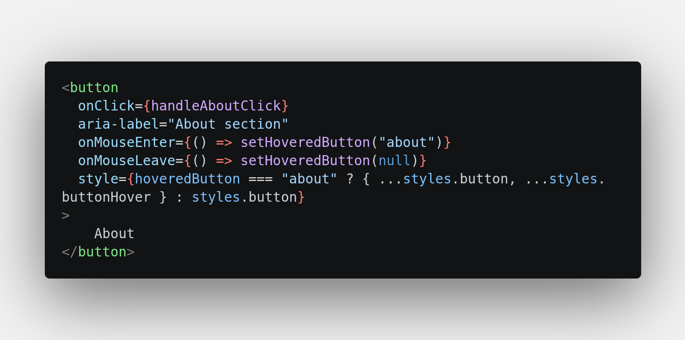

# Before Image Handling
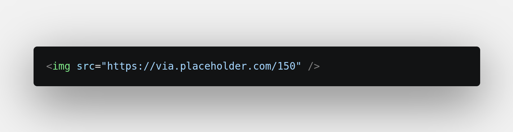

# After Image Handling
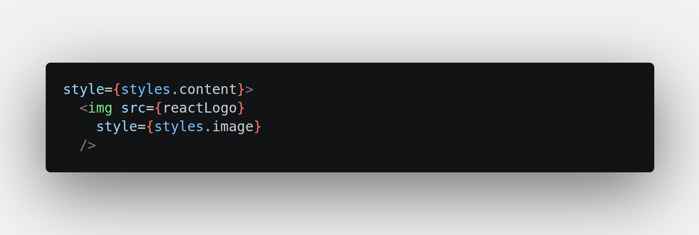

# Before Constants
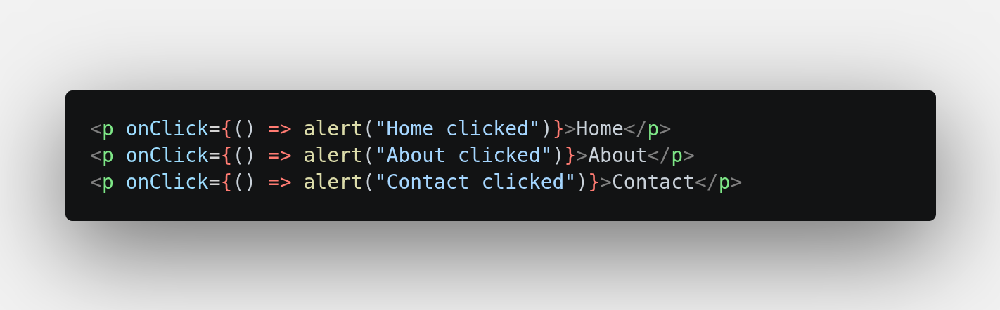

# After Constants
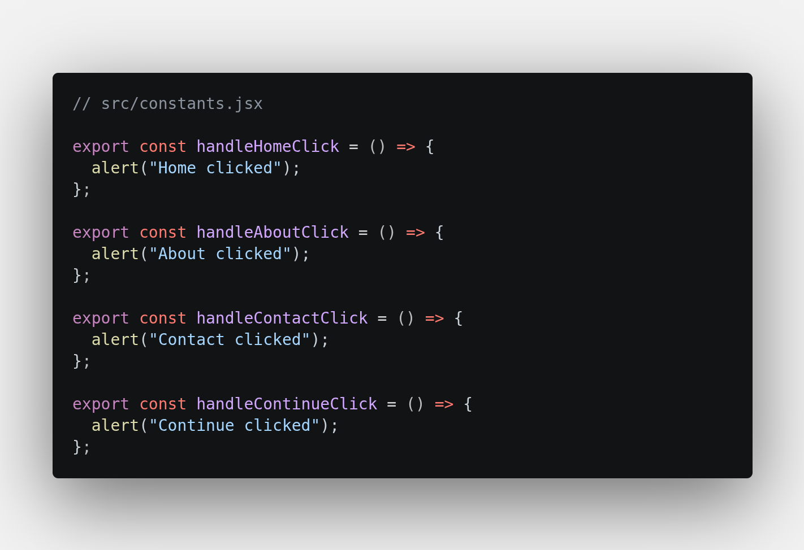
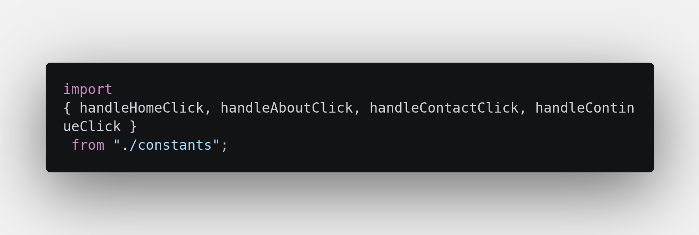

---

## ▶️ How to Run the Project

# Install dependencies:

npm install

# Start the development server:

npm run dev

# Then open:

http://localhost:5173

---

## 🛠 Tech Stack

 - React

 - Vite

 - JavaScript (ES6+)

 - ARIA attributes

 - Semantic HTML

 - Modular inline style objects

 ---

## 💡 What This Project Demonstrates

Identify and resolve accessibility issues using WCAG‑aligned best practices

Refactor UI components to improve clarity, structure, and user experience

Apply ARIA attributes effectively to enhance screen‑reader support

Ensure full keyboard accessibility, including focus management and interaction states

Use React hooks (useState) to manage interactive and accessible UI behaviour

Organise styles into a modular, scalable architecture using a dedicated Styles.js file

Write clean, maintainable, and semantic React code that is easy to extend and audit

 ---

 ## ⭐ Why Accessibility Matters

Accessibility ensures that all users — including those using assistive technologies — can interact with your application.
This project demonstrates your commitment to building inclusive, user‑friendly interfaces that work for everyone.

---

## 📬 Want Something Similar?

If you need help cleaning up your React components, improving UI consistency, or fixing layout and accessibility issues, I can help.  